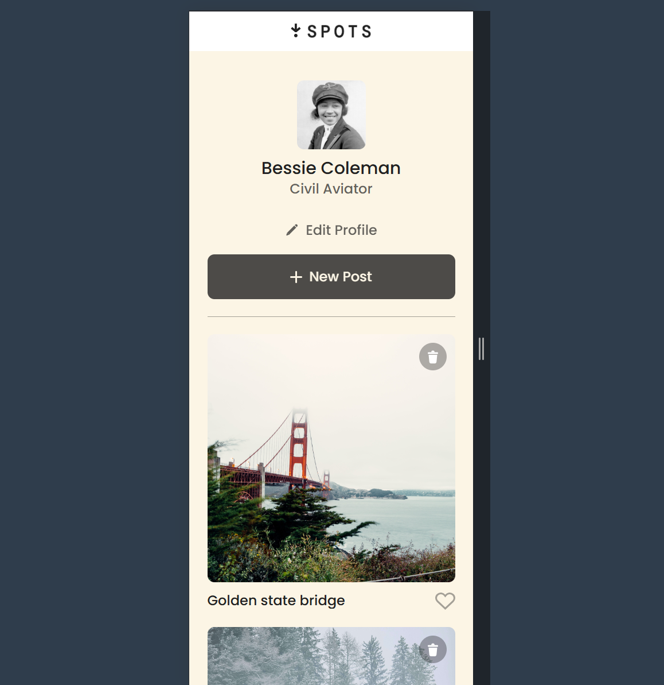
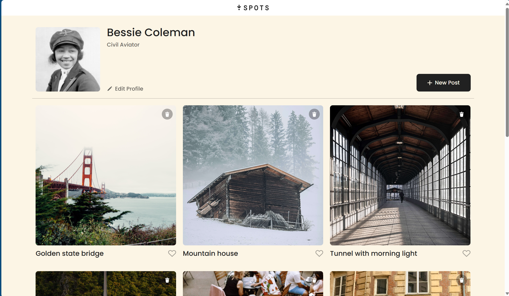

# Project 3: Spots

### Overview

- Intro
- Figma
- Images

**Intro**

This project is made so all the elements are displayed correctly on popular screen sizes.

**Figma**

- [Link to the project on Figma](https://www.figma.com/file/BBNm2bC3lj8QQMHlnqRsga/Sprint-3-Project-%E2%80%94-Spots?type=design&node-id=2%3A60&mode=design&t=afgNFybdorZO6cQo-1)

**Images**

**Tech Stack**

-HTML
-CSS
-Responsive Design

**Deployment**

The webpage is deployed to GitHub Pages

-[Deployment Link](https://layz092.github.io/se_project_spots/)

**Project Video**

You can watch the project walkthrough video [here](https://drive.google.com/file/d/1jAIThqWVshe4bQZ1GY-PBED-c_6DEwua/view?usp=drive_link)
